# Credit_Risk_Analysis

# Overview: 

This analysis was to create a supervised machine learning model that could accurately predict credit risk. In order to complete this task, I used 6 different methods, which are:

Naive Random Oversampling

SMOTE Oversampling

Cluster Centroid Undersampling

SMOTEENN Sampling

Balanced Random Forest Classifying

Easy Ensemble Classifying

Through each of these methods, I split my data into training and testing datasets, and compiled accuracy scores, confusion matries, and classification reports as my results.

# Results: 

**Native Randon Oversampling**

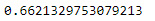

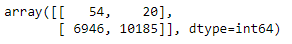

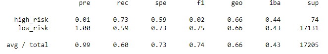

•	The balanced accuracy score is 66.2%.

•	The high risk precision is about 1%, low risk precision is about 100%.

•	The high recall risk is about 73%, low recall risk is about 59%.

**SMOTE Oversampling**

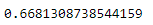

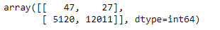

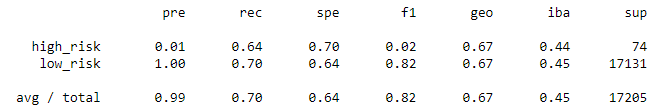

•	The balanced accuracy score is 66.8%.

•	The high risk precision is about 1%, low risk precision is about 100%.

•	The high recall risk is about 64%, low recall risk is about 70%.

**Cluster Centroid Undersampling**

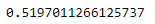

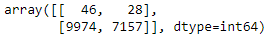

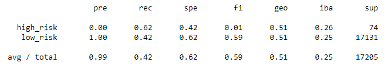

•	The balanced accuracy score is about 52%.

•	The high risk precision is about 0%, low risk precision is about 100%.

•	The high recall risk is about 62%, low recall risk is about 42%.

**SMOTEENN Sampling**

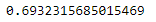

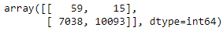

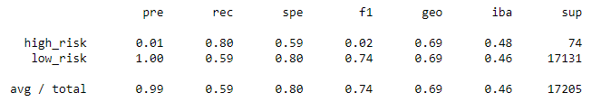

•	The balanced accuracy score is about 69%.

•	The high risk precision is about 1%, low risk precision is about 100%.

•	The high recall risk is about 80%, low recall risk is about 59%.

**Balanced Random Forest Classifying**

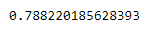

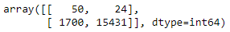

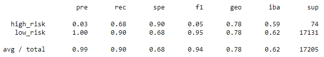

•	The balanced accuracy score is about 78.8%.

•	The high risk precision is about 3%, low risk precision is about 100%.

•	The high recall risk is about 68%, low recall risk is about 90%.

**Easy Ensemble Classifying**

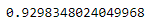

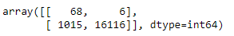

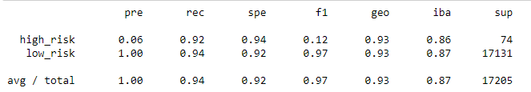

•	The balanced accuracy score is about 93%.

•	The high risk precision is about 6%, low risk precision is about 100%.

•	The high recall risk is about 92%, low recall risk is about 94%.

# Summary: 

This analysis is trying to find the best model that can detect if a loan is high risk or not. Finding a model that lets the least amount of high risk loans pass through undetected would be best.That correlating statistic for this would be the recall rate for high risk. The one with the highest recall rate is Easy Ensemble Classifying with 93%, followed by Balanced Random Forest Classifying with 78.8%. 
I would recommend Easy Ensemble Classification over any of the other 5 models.
